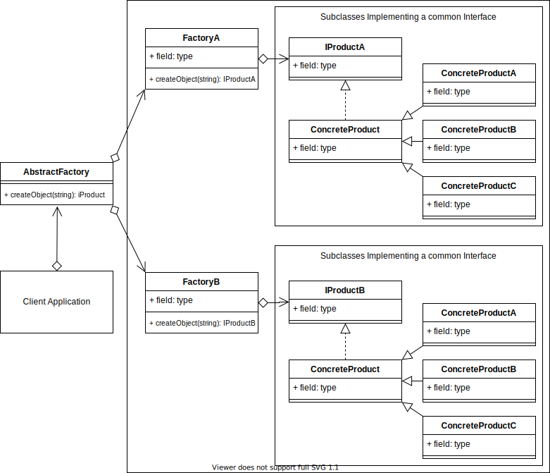

# Abstract Factory Design Pattern

## Overview

The Abstract Factory Pattern adds an abstraction layer over multiple other creational pattern implementations.

To begin with, in simple terms, think if it as a Factory that can return Factories. Although you will find examples of it also being used to return Builder, Prototypes, Singletons or other design pattern implementations

## Terminology

* **Client**: The client application that calls the Abstract Factory. It's the same process as the Concrete Creator in the Factory design pattern.

* **Abstract Factory**: A common interface over all the sub factories.

* **Concrete Factory**: The sub factory of the Abstract Factory and contains method(s) to allow creating the Concrete Product.

* **Abstract Product**: The interface and/or abstraction for the product that the sub factory returns.

* **Concrete Product**: The object that is finally returned.

> 
> [concept code](./concept.ts)

## Summary

* Use when you want to provide a library of relatively similar products from multiple different factories.
* You want the system to be independent of how the products are created.
* It fulfills all the same use cases as the Factory method, but is a factory for creational pattern type methods.
* The client implements the abstract factory interface, rather than all the internal logic and Factories. This allows the possibility of creating a library that can be imported for using the Abstract Factory.
* The Abstract Factory defers the creation of the final products/objects to its concrete factory subclasses.
* You want to enforce consistent interfaces across products.
You want the possibility to exchange product families.

[<--- Back to patterns list](../../patterns.md)
