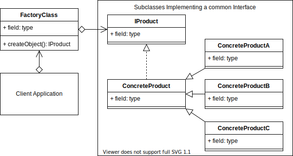

# Factory Design Pattern

## Overview

When developing code, you may instantiate objects directly in methods or in classes. While this is quite normal, you may want to add an extra abstraction between the creation of the object and where it is used in your project.

You can use the Factory pattern to add that extra abstraction. The Factory pattern is one of the easiest patterns to understand and implement.

Adding an extra abstraction will also allow you to dynamically choose classes to instantiate based on some kind of logic.

Before the abstraction, your client, class or method would directly instantiate an object of a class. After adding the factory abstraction, the concrete product (object) is now created outside the current class/method, and now in a subclass instead.

Imagine an application for designing houses and the house has a chair already added on the floor by default. By adding the factory pattern, you could give the option to the user to choose different chairs, and how many at runtime. Instead of the chair being hard coded into the project when it started, the user now has the option to choose.

Adding this extra abstraction also means that the complications of instantiating extra objects can now be hidden from the class or method that is using it.

This separation also makes your code easier to read and document.

The Factory pattern is really about adding that extra abstraction between the object creation and where it is used. This gives you extra options that you can more easily extend in the future.

## Terminology

* **Concrete Creator**: The client application, class or method that calls the Creator (Factory method).

* **Product Interface**: The interface describing the attributes and methods that the Factory will require in order to create the final product/object.

* **Creator**: The Factory class. Declares the Factory method that will return the object requested from it.

* **Concrete Product**: The object returned from the Factory. The object implements the Product interface.

> 
> [concept code](./concept.ts)

## Summary

* The Factory Pattern defers the creation of the final object to a subclass.
* The Factory pattern is about inserting another layer/abstraction between instantiating an object and where in your code it is actually used.
* It is unknown what or how many objects you will need to be created until runtime.
* You want to localize knowledge of the specifics of instantiating a particular object to the subclass so that the client doesn't need to be concerned about the details.
* You want to create an external framework, that an application can import/reference, and hide the details of the specifics involved in creating the final object/product.
* The unique factor that defines the Factory pattern, is that your project now defers the creation of objects to the subclass that the factory had delegated it to.

[<--- Back to patterns list](../../patterns.md)
