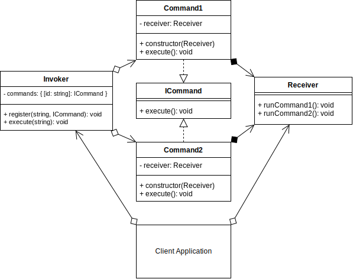

# Command Design Pattern

## Overview

The Command pattern is a behavioral design pattern, in which an abstraction exists between an object that invokes a command, and the object that performs it.

E.g., a button will call the Invoker, that will call a pre-registered Command, that the Receiver will perform.

A Concrete Class will delegate a request to a command object, instead of implementing the request directly.

The command pattern is a good solution for implementing UNDO/REDO functionality into your application.

Uses:

* GUI Buttons, menus
* Macro recording
* Multi-level undo/redo
* Networking - send whole command objects across a network, even as a batch
* Parallel processing or thread pools
* Transactional behavior
* Wizards

## Terminology

* **Receiver**: The object that will receive and execute the command.
* **Invoker**: The object that sends the command to the receiver. E.g., A button.
* **Command Object**: Itself, an object, that implements an execute(), or other action method, and contains all required information to execute it.
* **Client**: The application or component that is aware of the Receiver, Invoker and Commands.

> 
>
> [concept code](./concept.ts)

## Summary

* State should not be managed in the Command object itself.
* There can be one or more Invokers that can execute the Command at a later time.
* The Command object is especially useful if you want to UNDO/REDO commands at later time.
* The Command pattern is similar to the Memento pattern in the way that it can also be used for UNDO/REDO purposes. However, the Memento pattern is about recording and replacing the state of an object, whereas the Command pattern executes a predefined command. E.g., Draw, Turn, Resize, Save, etc.

[<--- Back to patterns list](../../patterns.md)
