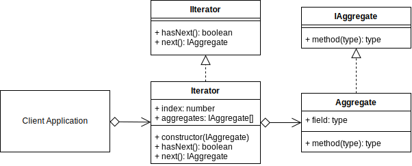

# Iterator Design Pattern

## Overview

The Iterator will commonly contain two methods that perform the following concepts.

* **next**: returns the next object in the aggregate (collection, object).
* **hasNext**: returns a Boolean indicating if the Iterable is at the end of the iteration or not.
The benefits of using the Iterator pattern are that the client can traverse a collection of aggregates(objects) without needing to understand their internal representations and/or data structures.

## Terminology

* **Iterator Interface**: The Interface for an object to implement.
* **Concrete Iterator**: (Iterable) The instantiated object that implements the iterator and contains a collection of aggregates.
* **Aggregate Interface**: An interface for defining an aggregate (object).
* **Concrete Aggregate**: The object that implements the Aggregate interface.

> 
>
> [concept code](./concept.ts)

## Summary

* Use an iterator when you need to traverse over a collection, or you want an object that can output a series of dynamically created objects.
* At minimum, an iterator needs a next equivalent method that returns an object.
* Optionally you can also create a helper function that indicates whether an iterator is at the end or not. This is useful if you use your iterator in a while loop.

[<--- Back to patterns list](../../patterns.md)
