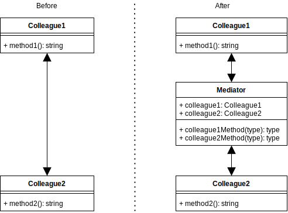

# Mediator Design Pattern

## Overview

Objects communicate through the Mediator rather than directly with each other.

As a system evolves and becomes larger and supports more complex functionality and business rules, the problem of communicating between these components becomes more complicated to understand and manage. It may be beneficial to refactor your system to centralize some or all of its functionality via some kind of mediation process.

The mediator pattern is similar to implementing the Facade pattern between your objects and processes. Except that the structure of the Mediator could also allow multi-directional communication between each component and provide the opportunity to add some logic to the messaging flow to make it more cooperative in some way. E.g., managing the routing behavior by serializing or batching messages, the centralization of application logic, caching, logging, etc.

## Terminology

* **Mediator**: The coordinator of communications between the components (colleagues).
* **Colleagues**: One of the many types of concrete components that use the mediator.

> 
>
> [concept code](./concept.ts)

## Summary

* A mediator replaces a structure with many-to-many interactions between its classes and processes, with a one-to-many centralized structure where the interface supports all the methods of the many-to-many structure, but via the mediator component instead.
* The mediator pattern encourages usage of shared objects that can now be centrally managed and synchronized.
* The mediator pattern creates an abstraction between two or more components that then makes a system easier to understand and manage.
* The mediator pattern is similar to the Facade pattern, except the Mediator can also transact data both ways between two or more other classes or processes that would normally interact directly with each other.

[<--- Back to patterns list](../../patterns.md)
