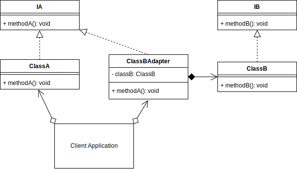

# Adapter Design Pattern

## Overview

Sometimes classes have been written, and you don't have the option of modifying their interface to suit your needs. This happens if the method you are calling is on a different system across a network, a library that you may import or generally something that is not viable to modify directly for your particular needs.

The Adapter design pattern solves these problems:

* How can a class be reused that does not have an interface that a client requires?
* How can classes that have incompatible interfaces work together?
* How can an alternative interface be provided for a class?

You may have two classes that are similar, but they have different method signatures, so you create an Adapter over top of one of the method signatures so that it is easier to implement and extend in the client.

An adapter is similar to the Decorator in the way that it also acts like a wrapper to an object. It is also used at runtime; however, it is not designed to be used recursively.

It is an alternative interface over an existing interface. Furthermore, it can also provide extra functionality that the interface being adapted may not already provide.

The adapter is similar to the Facade, but you are modifying the method signature, combining other methods and/or transforming data that is exchanged between the existing interface and the client.

The Adapter is used when you have an existing interface that doesn't directly map to an interface that the client requires. So, then you create the Adapter that has a similar functional role, but with a new compatible interface.

## Terminology

* **Target**: The domain specific interface or class that needs to be adapted.
* **Adapter**: The concrete adapter class containing the adaption process.
* **Adapter Interface**: The interface that the adapter will need to implement in order to make the target compatible with the client.
* **Client**: The client application that will use the Adapter.

> 
>
> [concept code](./concept.ts)

## Summary

* Use the decorator when you want to add responsibilities to objects dynamically without affecting the inner object.
* You want the option to later remove the decorator from an object in case you no longer need it.
* It is an alternative method to creating multiple combinations of subclasses. I.e., Instead of creating a subclass with all combinations of objects A, B, C in any order, and including/excluding objects, you could create 3 objects that can decorate each other in any order you want. E.g., (C(A(C))) or (B(C)) or (A(B(A(C))))
* The decorator, compared to extending, is more flexible since you can easily add/remove the decorators at runtime. E.g., use in a recursive function.
* A decorator supports recursive composition. E.g., halve(halve(number))
* A decorator shouldn't modify the internal objects data or references. This allows the original object to stay intact if the decorator is later removed.

[<--- Back to patterns list](../../patterns.md)
