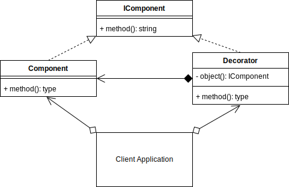

# Decorator Design Pattern

## Overview

The **decorator pattern** is a structural pattern, that allows you to attach additional responsibilities to an object at runtime.

The decorator pattern is used in both the Object-Oriented and Functional paradigms.

The decorator pattern adds extensibility without modifying the original object.

The decorator forwards requests to the enclosed object and can perform extra actions.

You can nest decorators recursively.

## Terminology

* **Component Interface**: An interface for objects.
* **Component**: The object that may be decorated.
* **Decorator**: The class that applies the extra responsibilities to the component being decorated. It also implements the same component interface.

> 
>
> [concept code](./concept.ts)

## Summary

* Use the decorator when you want to add responsibilities to objects dynamically without affecting the inner object.
* You want the option to later remove the decorator from an object in case you no longer need it.
* It is an alternative method to creating multiple combinations of subclasses. I.e., Instead of creating a subclass with all combinations of objects A, B, C in any order, and including/excluding objects, you could create 3 objects that can decorate each other in any order you want. E.g., (C(A(C))) or (B(C)) or (A(B(A(C))))
* The decorator, compared to extending, is more flexible since you can easily add/remove the decorators at runtime. E.g., use in a recursive function.
* A decorator supports recursive composition. E.g., halve(halve(number))
* A decorator shouldn't modify the internal objects data or references. This allows the original object to stay intact if the decorator is later removed.

[<--- Back to patterns list](../../patterns.md)
